We will deploy LDAP, NFS server, and NFS client virtual machines to OpenShift to demonstrate the use of autofs. 
In [part 1][3] used on-cluster image layering to add autofs to our OpenShift nodes. 
Now we will deploy the infrastructure to provide autofs mounts using OpenShift Virualization.

<!--more-->

# Overview
## VirtualMachines As A Components

We will use [Kustomize][6] to deploy each virtual machine along with cloud-init to automate the configuration of each VM.

You can take advantage of the OpenShift Templates to generate a consistent `virtualmachine.yaml` and if the template updates you can just regenerate the base VM definition as a component.

```bash
oc process \
 template/rhel9-server-small \
 -n openshift \
 -p NAME=nfs \
 -o yaml \
 | yq e '.items[0]' > componenets/vms/nfs/virtualmachine.yaml
```

> 
  ```bash
  tree -L 3 components
   components
  ├──  automount-role
  │   ├──  kustomization.yaml
  │   ├──  role.yaml
  │   ├──  rolebinding.yaml
  │   └──  serviceaccount.yaml
  └──  vms
      ├──  client
      │   ├──  kustomization.yaml
      │   └──  virtualmachine.yaml
      ├──  ldap
      │   ├──  kustomization.yaml
      │   └──  virtualmachine.yaml
      └──  nfs
          ├──  kustomization.yaml
          └──  virtualmachine.yaml
  ```
  

And then use Kustomize to apply any changes to the VM using patches applied to this base VM component.

For example [here][4] is the basic VirtualMachine definition for the NFS server generatd above, and [here][5] is the `kustomization.yaml` used to make the changes to it. I'll describe the changes a bit later.

## Cloud-init

We will use [cloud-init][7] to perform all the required VM configuration at boot time.

[Here][8] is the cloud-init script used for the NFS server. Again, more details to follow.

## Networking

Instead of the Cluster or Pod network, each VM will be have a NIC bound via a Network Attachment Definition of toplogy "localnet" defined to be on the same VLAN segment that the physical OpenShift nodes are on. The nodes and the VMs will all have IPs in `192.168.4.0/24` on VLAN `1924`.

```mermaid
graph LR;
    nad-1924 <--> vlan-1924
    vlan-1924[🛜 VLAN 1924<br>192.168.4.0/24<br>]:::vlan-1924;

    subgraph Physical["Physical"]
      subgraph node1
        node1-eth0[eth0]:::node-eth;
      end
      subgraph node2
        node2-eth0[eth0]:::node-eth;
      end
      subgraph node3
        node3-eth0[eth0]:::node-eth;
      end


      node1-eth0 ==> vlan-1924
      node2-eth0 ==> vlan-1924;
      node3-eth0 ==> vlan-1924;
    end

    subgraph Virtual["Virtual"]

      subgraph Localnets["Localnet NADs"]
          nad-1924[Machine Net]:::nad-1924;
      end

      subgraph NFS-Server["NFS Server"]
          server-1-eth0[eth0]:::vm-eth;
      end

      subgraph LDAP-Server["LDAP Server"]
          server-2-eth0[eth0]:::vm-eth;
      end

      subgraph Client
          server-3-eth0[eth0]:::vm-eth;
      end
    end

    server-1-eth0 -.-> nad-1924
    server-2-eth0 -.-> nad-1924
    server-3-eth0 -.-> nad-1924



    classDef node-eth fill:#00dddd,stroke:#333,stroke-width:2px;
    classDef vm-eth fill:#00ffff,stroke:#444,stroke-width:2px,stroke-dasharray: 1 1;


    classDef vlan-1924 fill:#00dddd,stroke:#333,stroke-width:2px;
    classDef nad-1924 fill:#00ffff,stroke:#333,stroke-width:2px,stroke-dasharray: 5 5;


    classDef networks fill:#cdd,stroke-width:0px

    style Localnets stroke-width:0px;
    style Physical fill:#fff,stroke:#333,stroke-width:3px
    style Virtual fill:#fff,stroke:#333,stroke-width:2px,stroke-dasharray: 5 5;

    classDef servers stroke-width:3px,stroke-dasharray: 5 5;
    class NFS-Server,LDAP-Server,Client servers

    classDef nodes stroke-width:3px
    class node1,node2,node3 nodes

```



# Server Deployment
Let's begin to deploy these VMs! 🎉

## Deploying NFS VM

### User Dirs
### Exports

## Deploying LDAP VM
### LDAP Schemas
### Automount Maps
## Deploying Client VM
### SSSD


# Demo 

> 
  <p>Deploying VMs...</p>
  
  

# Summary

VMs are cool

# References

* [Demo Github Repo][1]
* [Demo Recording][2]
* [Kustomize][6]

[1]: <https://github.com/dlbewley/demo-autofs/> "Demo Github Repo"
[2]: <https://> "Asciinema Demo Recording"
[3]:  "Part 1"
[4]: <https://github.com/dlbewley/demo-autofs/blob/main/components/vms/nfs/virtualmachine.yaml> "NFS VM"
[5]: <https://github.com/dlbewley/demo-autofs/blob/main/nfs/base/kustomization.yaml#L31> "NFS VM Kustomization"
[6]: <https://kustomize.io> "Kustomize"
[7]: <https://cloud-init.io> "Cloud-init"
[8]: <https://github.com/dlbewley/demo-autofs/blob/main/nfs/base/scripts/userData>