We will deploy LDAP, NFS server, and NFS client virtual machines to OpenShift to demonstrate the use of autofs. 
In [part 1][3] used on-cluster image layering to add autofs to our OpenShift nodes. 
Now we will deploy the infrastructure to provide autofs mounts using OpenShift Virualization.

<!--more-->

# Overview
## VirtualMachines As A Components

We will use [Kustomize][6] to deploy each virtual machine along with cloud-init to automate the configuration of each VM.

You can take advantage of the OpenShift Templates to generate a consistent `virtualmachine.yaml` and if the template updates you can just regenerate the base VM definition as a component.

```bash
oc process \
 template/rhel9-server-small \
 -n openshift \
 -p NAME=nfs \
 -o yaml \
 | yq e '.items[0]' > componenets/vms/nfs/virtualmachine.yaml
```

> 
  ```bash
  tree -L 3 components
   components
  ├──  automount-role
  │   ├──  kustomization.yaml
  │   ├──  role.yaml
  │   ├──  rolebinding.yaml
  │   └──  serviceaccount.yaml
  └──  vms
      ├──  client
      │   ├──  kustomization.yaml
      │   └──  virtualmachine.yaml
      ├──  ldap
      │   ├──  kustomization.yaml
      │   └──  virtualmachine.yaml
      └──  nfs
          ├──  kustomization.yaml
          └──  virtualmachine.yaml
  ```
  

And then use Kustomize to apply any changes to the VM using patches applied to this base VM component.

For example [here][4] is the basic VirtualMachine definition for the NFS server generatd above, and [here][5] is the `kustomization.yaml` used to make the changes to it. I'll describe the changes a bit later.

## Cloud-init

We will use [cloud-init][7] to perform all the required VM configuration at boot time.

## Networking

Instead of the Cluster or Pod network, each VM will be have a NIC bound via a Network Attachment Definition of toplogy "localnet" defined to be on the same VLAN segment that the physical OpenShift nodes are on. The nodes and the VMs will all have IPs in `192.168.4.0/24` on VLAN `1924`.

```mermaid
graph LR;
    Internet["☁️ "]:::Internet
    vlan-1924[🛜 VLAN 1924<br>192.168.4.0/24<br>]:::vlan-1924;
    vlan-1924 ==> Internet
    nad-1924 <---> vlan-1924

    subgraph Physical["Physical"]
      subgraph node1["🖥️ Node 1"]
        node1-eth0[eth0 🔌]:::node-eth;
      end
      subgraph node2["🖥️ Node 2"]
        node2-eth0[eth0 🔌]:::node-eth;
      end
      subgraph node3["🖥️ Node 3"]
        node3-eth0[eth0 🔌]:::node-eth;
      end

      node1-eth0 ==> vlan-1924
      node2-eth0 ==> vlan-1924;
      node3-eth0 ==> vlan-1924;
    end

    subgraph Virtual["Virtual"]
      subgraph Localnets["Localnet NADs"]
          nad-1924[🛜 Machine Net]:::nad-1924;
      end

      subgraph NFS-Server["🗄️ NFS Server"]
          server-1-eth0[eth0 🔌]:::vm-eth;
      end

      subgraph LDAP-Server["🔎 LDAP Server"]
          server-2-eth0[eth0 🔌]:::vm-eth;
      end

      subgraph Client["💻 Client"]
          server-3-eth0[eth0 🔌]:::vm-eth;
      end
    end

    server-1-eth0 -.-> nad-1924
    server-2-eth0 -.-> nad-1924
    server-3-eth0 -.-> nad-1924

    classDef node-eth fill:#00dddd,stroke:#333,stroke-width:2px;
    classDef vm-eth fill:#00ffff,stroke:#444,stroke-width:2px,stroke-dasharray: 1 1;

    classDef vlan-1924 fill:#00dddd,stroke:#333,stroke-width:2px;
    classDef nad-1924 fill:#00ffff,stroke:#333,stroke-width:2px,stroke-dasharray: 5 5;

    classDef networks fill:#cdd,stroke-width:0px

    style Localnets stroke-width:0px;
    style Physical color:#ccc,fill:#fff,stroke:#333,stroke-width:3px
    style Virtual color:#ddd,fill:#fff,stroke:#333,stroke-width:2px,stroke-dasharray: 5 5;
    style Internet fill:none,stroke-width:0px,font-size:+2em;

    classDef servers stroke-width:3px,stroke-dasharray: 5 5;
    class NFS-Server,LDAP-Server,Client servers

    classDef nodes stroke-width:3px
    class node1,node2,node3 nodes

```



# Server Deployment
Let's begin to deploy these VMs! 🎉

## Deploying the NFS VM 🗄️

The NFS server setup is fairly simple. We'll create home directories in a particular location and tell the NFS server to export them for mounting by trusted clients.

### Creating User Home Dirs

In the [NFS cloud-init script][8] we create home directories for our in `/exports/home` like this

```bash
#cloud-config
users:
  - name: dale
    ssh_authorized_keys:
      - ssh-rsa AAA... dale@foo
    uid: 1001
    lock_passwd: true
    homedir: /exports/home/dale
```
### Exporting Home Dirs

We will store the exports file in a [configmap generated](https://github.com/dlbewley/demo-autofs/blob/main/nfs/base/kustomization.yaml#L19-L21) by kustomize and then mount that confimap as an ISO  under `/opt` and copy it using cloud-init to `/etc/exports.d`. This makes it a little more externally maintainable. It could make sense to do the copy in a one short service so configmap updates could be interpolated by a reboot. 🤔

```bash
# file: /etc/exports.d/home.exports
/exports/home 192.168.4.0/24(rw,sync,no_subtree_check,no_root_squash)
```

This will export all the user home directories to our machine network where both our nodes and our client VM are connected.

### Starting nfsd

> ⚠️ ![!WARNING] **TODO**
> Fix the kustomize to create `cloudinitdisk-nfs`!

In the cloud-init we also install nfs-utils and enable `nfs-server` and `rpcbind` services.

```bash
$ oc apply -k nfs/base
namespace/demo-nfs created
configmap/exports created
secret/cloudinitdisk-client created
virtualmachine.kubevirt.io/nfs created

$ virtctl start nfs -n demo-nfs
VM nfs was scheduled to start
```

After a few moments we have a working NFS server.

## Deploying the LDAP VM 🔎

The LDAP setup is where all the heavy lifting is. Red Hat dropped the `openldap-servers` package for some reason (to favor RDS), so we have to go download the RPM from [rpmfind](https://rpmfind.net/linux/epel/9/Everything/x86_64/Packages/o/).

To configure the LDAP server to understand the automount schema and to load it with oour automount maps we will use a [shell script][11] that will be run by the [LDAP cloud-init script][9] with all the 

### LDAP Schemas

Again we let [kustomize generate configmaps](https://github.com/dlbewley/demo-autofs/blob/main/ldap/base/kustomization.yaml#L19-L27) from our scripts. A configmap called `ldap-ldif` will hold our LDIF files and the shell script to apply them..

In [the cloud-init][9] will will mount the config-map 

```bash
mounts:
  - [ /dev/disk/by-id/virtio-ldap-ldif, /opt, iso9660, 'defaults' ]
```

After mounting the configmap we'll exectue the script

```bash
runcmd:
  # lines omitted...
  - [cp, /opt/ldap-load.sh, /usr/local/bin/ldap-load.sh]
  - [chmod, "755", /usr/local/bin/ldap-load.sh]
  - [/usr/local/bin/ldap-load.sh]
```

> 
  ```bash {{ linenos=inline }}
  #!/bin/bash

  echo "(core.ldif) Adding OpenLDAP core schemas"

  ldapadd -Y EXTERNAL -H ldapi:/// -f /etc/openldap/schema/core.ldif

  echo "(cosine.ldif) Adding OpenLDAP cosine schema"
  ldapadd -Y EXTERNAL -H ldapi:/// -f /etc/openldap/schema/cosine.ldif

  echo "(nis.ldif) Adding OpenLDAP nis schema"
  ldapadd -Y EXTERNAL -H ldapi:/// -f /etc/openldap/schema/nis.ldif

  echo "(inetorgperson.ldif) Adding OpenLDAP inetorgperson schema"
  ldapadd -Y EXTERNAL -H ldapi:/// -f /etc/openldap/schema/inetorgperson.ldif

  echo "(autofs.ldif) Adding OpenLDAP autofs schema"
  ldapadd -Y EXTERNAL -H ldapi:/// -f /opt/autofs.ldif

  echo "(modify-suffix.ldif) Updating OpenLDAP suffix to lab.bewley.net"
  ldapadd -Y EXTERNAL -H ldapi:/// -f /opt/modify-suffix.ldif

  echo "(set-rootdn.ldif) Creating admin root dn with password"
  ldapadd -Y EXTERNAL -H ldapi:/// -f /opt/set-rootdn.ldif

  echo "(base.ldif) Creating base.ldif with cn=admin,dc=lab,dc=bewley,dc=net as root dn"
  ldapadd -x -D "cn=admin,dc=lab,dc=bewley,dc=net" -w ldap -H ldap:/// -f /opt/base.ldif

  echo "(automount.ldif) Creating automount maps and entries"
  ldapadd -x -D "cn=admin,dc=lab,dc=bewley,dc=net" -w ldap -H ldap:/// -f /opt/automount.ldif

  echo "(users.ldif) Creating users"
  ldapadd -x -D "cn=admin,dc=lab,dc=bewley,dc=net" -w ldap -H ldap:/// -f /opt/users.ldif
  ```
  


### Automount Maps

```bash
$ oc apply -k ldap/base
namespace/demo-ldap created
configmap/ldap-ldif created
secret/cloudinitdisk-ldap created
virtualmachine.kubevirt.io/ldap created

$ virtctl start ldap -n demo-ldap
VM ldap was scheduled to start
```

After a few moments we have a working LDAP server.

## Deploying the Client VM 💻
### SSSD


# Demo 

> 
  <p>Deploying VMs...</p>
  
  

# Summary

VMs are cool

# References

* [Demo Github Repo][1]
* [Demo Recording][2]
* [Kustomize][6]
* [NFS VM cloud-init][8]
* [LDAP VM cloud-init][9]
* [Client VM cloud-init][10]

[1]: <https://github.com/dlbewley/demo-autofs/> "Demo Github Repo"
[2]: <https://> "Asciinema Demo Recording"
[3]:  "Part 1"
[4]: <https://github.com/dlbewley/demo-autofs/blob/main/components/vms/nfs/virtualmachine.yaml> "NFS VM"
[5]: <https://github.com/dlbewley/demo-autofs/blob/main/nfs/base/kustomization.yaml#L31> "NFS VM Kustomization"
[6]: <https://kustomize.io> "Kustomize"
[7]: <https://cloud-init.io> "Cloud-init"
[8]: <https://github.com/dlbewley/demo-autofs/blob/main/nfs/base/scripts/userData> "NFS VM cloud-init"
[9]: <https://github.com/dlbewley/demo-autofs/blob/main/ldap/base/scripts/userData> "LDAP VM cloud-init"
[10]: <https://github.com/dlbewley/demo-autofs/blob/main/ldap/base/scripts/userData> "Client VM cloud-init"
[11]: <https://github.com/dlbewley/demo-autofs/blob/main/ldap/base/scripts/ldap-load.sh> "LDAP Load Script"