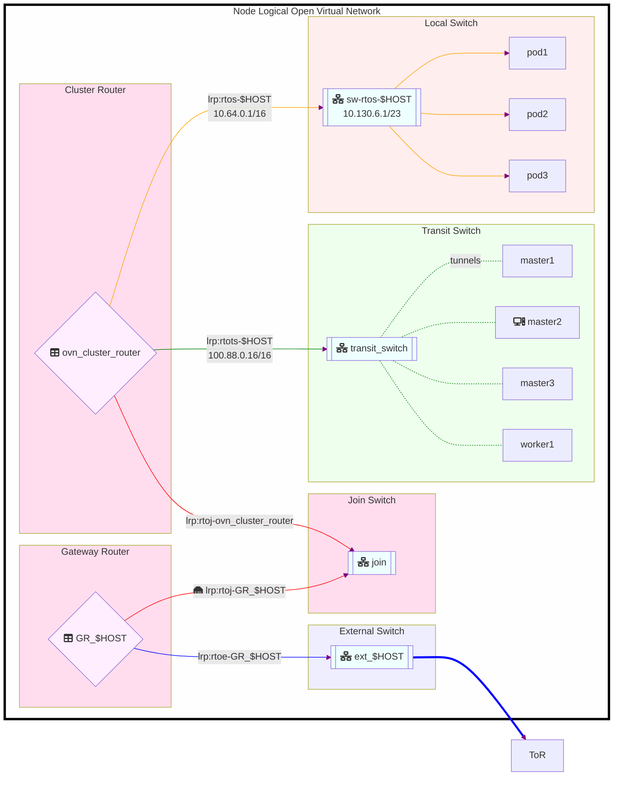

Accessing the details of the software defined networking features of OpenShift can be helpful for deeper troubleshooting or enhanced understanding. You'll not find a full explanation of [Open Virtual Network][1] or [OVN-Kubernetes][4] here, but you will learn how to quickly peer inside and investigate their inner workings.

<!--more-->

# Open Virtual Network

[Open Virtual Switch][5] has been used to power the software defined network on OpenShift within the defunct openshift-sdn CNI for quite some time. Now Open Virtual Network provides a higher level abstraction and orchestration of network features including virtual switches, routers, load balancers, and more via the ovn-kubernetes CNI.

**Demo: Access OVN Northbound Database**
> 
  
Demo showing how to talk to OVN nbdb from CLI.

  
  

**[Here][6] is the `ovncli` script used above:**
> 
  
  

<!--
Demo Script:
#!/bin/bash
# git clone https://github.com/paxtonhare/demo-magic.git
source ~/src/demos/demo-magic/demo-magic.sh
TYPE_SPEED=100
PROMPT_TIMEOUT=2
DEMO_PROMPT="${CYAN}guifree-ovn ${GREEN}$ ${COLOR_RESET}"
DEMO_COMMENT_COLOR=$GREEN

clear

p "# Open Virtual Network logical configuration is found in the northbound database"
p "# here is a script to access the northbound database of OVN"
pei 'bat `which ovncli`'
p
p '# here is how you would find and access the nbdb step by step'
p '# view all the OVN kubernetes pods'
pei "oc -n openshift-ovn-kubernetes get pods -o wide"

p '# now omit the controler pods'
pei "oc -n openshift-ovn-kubernetes get pods -l app=ovnkube-node -o wide"

p '# now just get the name of the first one'
pei "oc -n openshift-ovn-kubernetes get pods -l app=ovnkube-node -o jsonpath='{.items[0].metadata.name}{\"\n\"}'"

# do not show
pod=$(oc -n openshift-ovn-kubernetes get pods -l app=ovnkube-node -o jsonpath='{.items[0].metadata.name}')

p '# notice there are 8 containers in this pod'
pei "oc -n openshift-ovn-kubernetes get pod $pod -o yaml | yq '.spec.containers[].name'"

p '# we want to connect to the "nbdb" pod'
pei "oc rsh -c nbdb -n openshift-ovn-kubernetes $pod 2>/dev/null"

# type commands
# list logical switches
# ovn-nbctl ls-list
# list logical routers
# ovn-nbctl lr-list
# exit

p '# or we can just use the script like this'
p '# on node master-2'
pei "ovncli master-1 ovn-nbctl lr-list"
p
p '# on node master-2'
pei "ovncli master-2 ovn-nbctl lr-list"
 -->

# Visualizing The Network

We won't go any deeper here, but here is vizualization of the network resources at a host level which hints at how nodes are connected via geneve tunnels accessbile via the transit switch. More on all this in another post.





# Summary

OpenShift uses OVN-Kuberenets as the CNI which enables a very flexible if not complex network architecture. It can be helpful to peer inside at times, and this post gave you a cheat sheet to do just that.

# References

* [Open Virtual Switch][5]
* [Open Virtual Network][1]
* [OVN-Kubernetes][4]
* [OVN-Kubernetes CNI Plugin][3] - github.com
* [Container Network Interface Specification][2]
* [My ovncli.sh script][6]

[1]: <https://www.ovn.org/en/> "OpenVirtualNetwork"
[2]: <https://github.com/containernetworking/cni/blob/spec-v0.4.0/SPEC.md> "CNI v0.4.0 Specification"
[3]: <https://github.com/ovn-org/ovn-kubernetes> "OVN-Kubernetes CNI Plugin"
[4]: <https://ovn-kubernetes.io/> "OVN-Kubernetes"
[5]: <https://www.openvswitch.org/> "Open Virtual Switch"
[6]: <https://gist.github.com/dlbewley/b4d4c85931e7a9c03caf56db1a1a0d2e> "ovncli script"