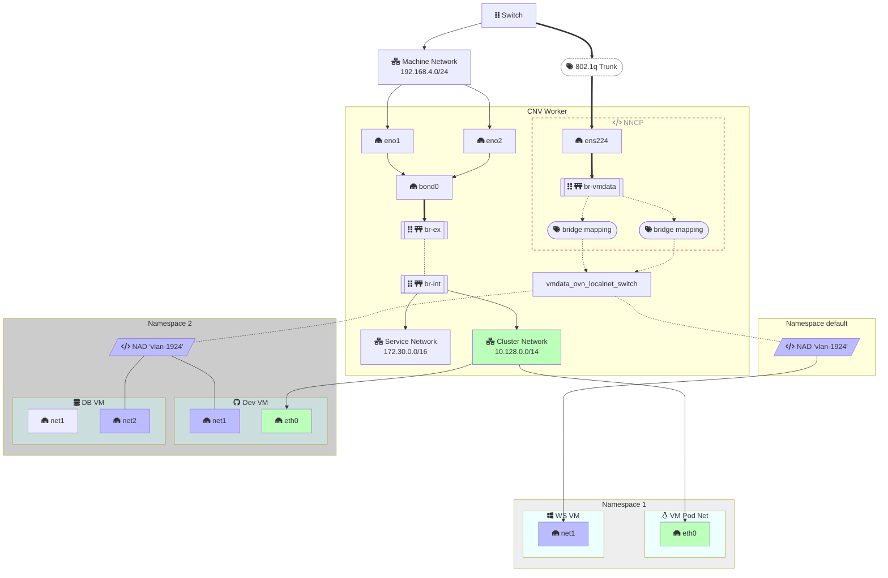
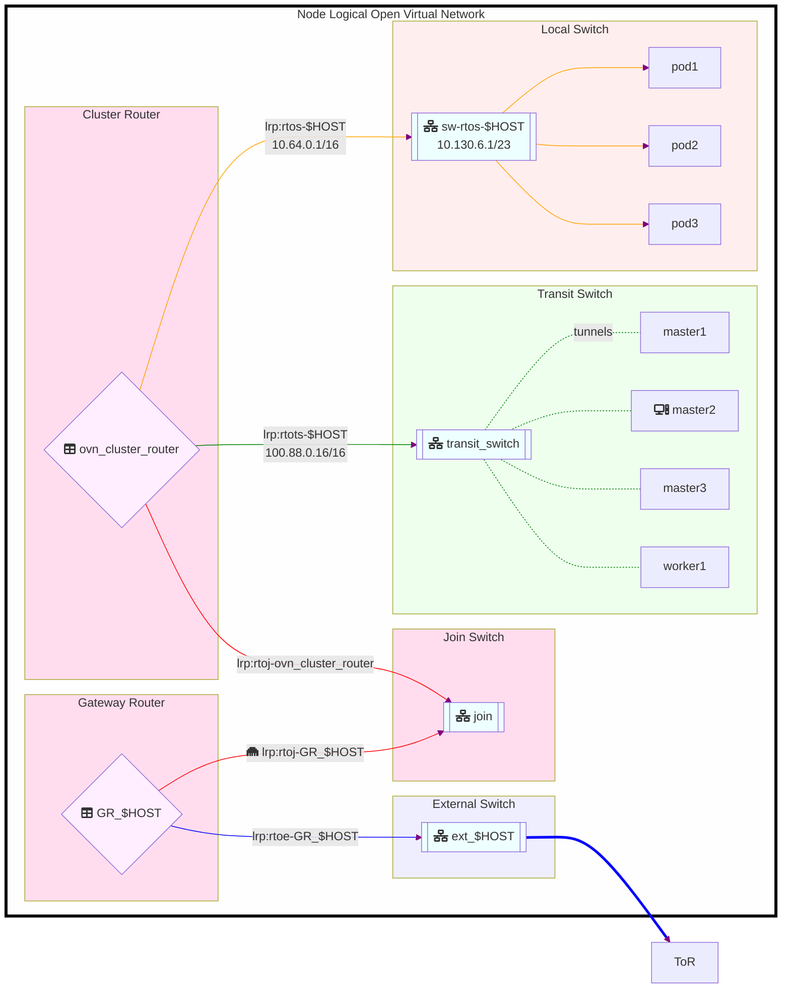
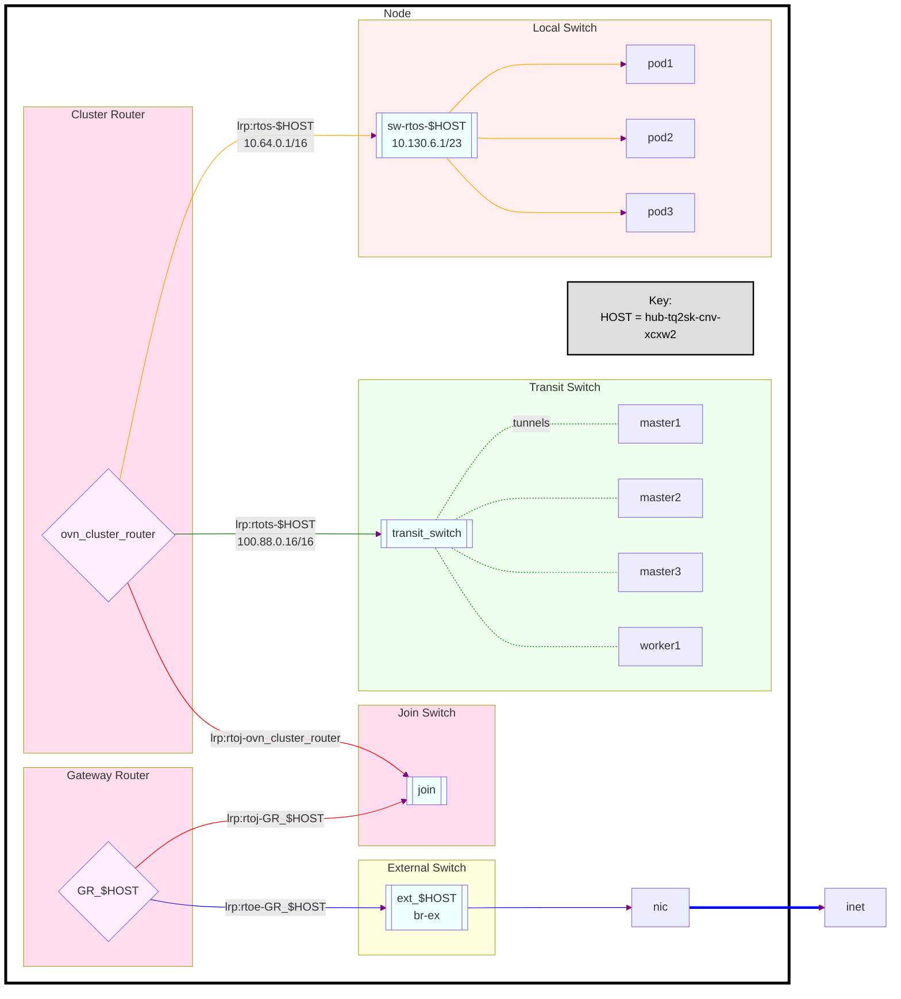

Virtual machine workloads are migrating to KubeVirt and OpenShift Virtualization at a rapid pace. Understanding how to securely access datacenter networks directly from pods will be critical to a successful migration. Read on to learn how [OVN-Kubernetes][11], [NMstate][3], and [Multus][12] work together to enable traditional architecutres in a cloud-native way.

<!--more-->

# Open Virtual Network

Open Virtual Network enables a high level representation of a software defined network. While virtual switches have been used in OpenShift for quite some time they were managed individualy, the method used to program and coordinate virtual switching and routing is now orchestrated by OVN technology.

<!--
Demo Script:


 -->

# Kubernetes Resource Management is API-First

All resources are managed by [APIs in Kubernetes][2]. This may be a new concept to some, but it is a great advantage over traditional infrastructure.
These APIs can be driven by the web console, by the command line, or application of resources via GitOps. The interface to these APIs are mediated by Resource Definitions.

There are a number of standard resources on every cluster like `pods`, `services`, `deployments`, and additional custom resource definitions may be made available by installing operators like [NMstate][3] or [KubeVirt][4].

This means anytime you seek to understand how to accomplish a task in Kubernetes you should start by learning what resources exist.

> 
Keep in mind that the same name may be used by more than one API. This can be disambiguated with the `--api-group` argument.
```bash {linenos=inline,hl_lines=[5,11,12]}
# 4.19.9
$  oc api-resources | grep -i network | sort
adminnetworkpolicies                       anp                                                                                    policy.networking.k8s.io/v1alpha1                     false        AdminNetworkPolicy
baselineadminnetworkpolicies               banp                                                                                   policy.networking.k8s.io/v1alpha1                     false        BaselineAdminNetworkPolicy
clusteruserdefinednetworks                                                                                                        k8s.ovn.org/v1                                        false        ClusterUserDefinedNetwork
egressrouters                                                                                                                     network.operator.openshift.io/v1                      true         EgressRouter
gatewayclasses                             gc                                                                                     gateway.networking.k8s.io/v1                          false        GatewayClass
gateways                                   gtw                                                                                    gateway.networking.k8s.io/v1                          true         Gateway
grpcroutes                                                                                                                        gateway.networking.k8s.io/v1                          true         GRPCRoute
httproutes                                                                                                                        gateway.networking.k8s.io/v1                          true         HTTPRoute
ingressclasses                                                                                                                    networking.k8s.io/v1                                  false        IngressClass
ingresses                                  ing                                                                                    networking.k8s.io/v1                                  true         Ingress
multi-networkpolicies                      multi-policy                                                                           k8s.cni.cncf.io/v1beta1                               true         MultiNetworkPolicy
network-attachment-definitions             net-attach-def                                                                         k8s.cni.cncf.io/v1                                    true         NetworkAttachmentDefinition
networkaddonsconfigs                                                                                                              networkaddonsoperator.network.kubevirt.io/v1          false        NetworkAddonsConfig
networkfenceclasses                                                                                                               csiaddons.openshift.io/v1alpha1                       false        NetworkFenceClass
networkfences                                                                                                                     csiaddons.openshift.io/v1alpha1                       false        NetworkFence
networkmaps                                                                                                                       forklift.konveyor.io/v1beta1                          true         NetworkMap
networkpolicies                            netpol                                                                                 networking.k8s.io/v1                                  true         NetworkPolicy
networks                                                                                                                          config.openshift.io/v1                                false        Network
networks                                                                                                                          operator.openshift.io/v1                              false        Network
nodenetworkconfigurationenactments         nnce                                                                                   nmstate.io/v1beta1                                    false        NodeNetworkConfigurationEnactment
nodenetworkconfigurationpolicies           nncp                                                                                   nmstate.io/v1                                         false        NodeNetworkConfigurationPolicy
nodenetworkstates                          nns                                                                                    nmstate.io/v1beta1                                    false        NodeNetworkState
operatorpkis                                                                                                                      network.operator.openshift.io/v1                      true         OperatorPKI
podnetworkconnectivitychecks                                                                                                      controlplane.operator.openshift.io/v1alpha1           true         PodNetworkConnectivityCheck
referencegrants                            refgrant                                                                               gateway.networking.k8s.io/v1beta1                     true         ReferenceGrant
userdefinednetworks                                                                                                               k8s.ovn.org/v1                                        true         UserDefinedNetwork
```


Once you identify the relevant resources for a task, you may want to read a description of the resource or find out read and write an instance of the resource in a YAML manifest.

> 
```text
$ oc explain multi-policy | head -10
GROUP:      k8s.cni.cncf.io
KIND:       MultiNetworkPolicy
VERSION:    v1beta1

DESCRIPTION:
    MultiNetworkPolicy is a CRD schema to provide NetworkPolicy mechanism for
    net-attach-def which is specified by the Network Plumbing Working Group.
    MultiNetworkPolicy is identical to Kubernetes NetworkPolicy, See:
    https://kubernetes.io/docs/concepts/services-networking/network-policies/ .

$ oc explain multi-policy.spec.ingress
GROUP:      k8s.cni.cncf.io
KIND:       MultiNetworkPolicy
VERSION:    v1beta1

FIELD: ingress <[]Object>

DESCRIPTION:
    List of ingress rules to be applied to the selected pods. Traffic is allowed
    to a pod if there are no NetworkPolicies selecting the pod (and cluster
    policy otherwise allows the traffic), OR if the traffic source is the pod's
    local node, OR if the traffic matches at least one ingress rule across all
    of the NetworkPolicy objects whose podSelector matches the pod. If this
    field is empty then this NetworkPolicy does not allow any traffic (and
    serves solely to ensure that the pods it selects are isolated by default)
    NetworkPolicyIngressRule describes a particular set of traffic that is
    allowed to the pods matched by a NetworkPolicySpec's podSelector. The
    traffic must match both ports and from.
...
```



## Networking Resource Managment in Kubernetes

Here is your networking custom resource decoder ring!

> 
```bash
$ oc api-resources --api-group nmstate.io
NAME                                 SHORTNAMES   APIVERSION           NAMESPACED   KIND
nmstates                                          nmstate.io/v1        false        NMState
nodenetworkconfigurationenactments   nnce         nmstate.io/v1beta1   false        NodeNetworkConfigurationEnactment
nodenetworkconfigurationpolicies     nncp         nmstate.io/v1        false        NodeNetworkConfigurationPolicy
nodenetworkstates                    nns          nmstate.io/v1beta1   false        NodeNetworkState

$ oc api-resources --api-group  k8s.cni.cncf.io
NAME                             SHORTNAMES       APIVERSION                NAMESPACED   KIND
multi-networkpolicies            multi-policy     k8s.cni.cncf.io/v1beta1   true         MultiNetworkPolicy
network-attachment-definitions   net-attach-def   k8s.cni.cncf.io/v1        true         NetworkAttachmentDefinition
```


Notice above that a `net-attach-def` resource is namespaced, and that a `nncp` is not. Because an NNCP is generally an underlying host level configuration and a network attachment definition can be made available to all user by placing in a namspace called "default" or they can be limited through RBAC place placing them only in the appropriate namespaces.

The NAD includes a blob of JSON data that defines a [CNI configuration][6]. The configuration drives a plugin that is one of several "types" with each type having additional arguments.

**CNI Plugin Types**

There are many, but these two are our focus here.

* `cnv-bridge` - Use when attaching to a Linux Bridge
* `ovn-k8s-cni-overlay` - Has a [topology parameter][8] which may be:
  * `localnet` - Define network local to the node (datacenter networks)
  * `layer2` - Define an overlay network (eg a private replication or healthcheck network)
  * `layer3` - Define a routeable overlay network

We are
https://github.com/ovn-org/ovn-kubernetes/blob/master/docs/multi-homing.md#configuring-secondary-networks

Use the `ovn-k8s-cni-overlay` plugin type and the `localnet` topology.


Unfortunately, when it comes to localnet, the NAD is overloaded. Not only does it define a namespaced attachment it also references a logical network and will implicitely create it if not already defined. It may be reasonable to expect there to be a custom resource definition for a network, but it turns out to be a side effect of NAD at this time. **This can be a source of misconfiguration and confusion.**

# Accessing Datacenter VLANs from OpenShift Virtual Machines

To attach a virtual machine to a "physical" network in a datacenter, as opposed to the private cluster network already present on the OpenShift cluster, requires the coordination of a few resources.


## Plumbing the VLAN to the Hypervisors

OpenShift servers are refered to as Nodes and those nodes participate in a cluster wide virtual network. Pods or containers running in the cluster are attached to what kubernetes calls the "cluster network", which is 10.128.0.0/14 by default.

> 
OpenShift exposes an API to configure the default cluster networking.
```yaml {linenos=inline,hl_lines=[11,12]}
 oc describe networks.config.openshift.io/cluster
Name:         cluster
Namespace:
Labels:       <none>
Annotations:  <none>
API Version:  config.openshift.io/v1
Kind:         Network
Metadata:
  ...snip
Spec:
  Cluster Network:
    Cidr:         10.128.0.0/14
    Host Prefix:  23
  External IP:
    Policy:
  Network Type:  OVNKubernetes
  Service Network:
    172.30.0.0/16
...snip
```


Traffic from a pod will normally egress from the cluster by way of a default bridge called `br-ex` where it will be Network Address Translated to the IP address found on `br-ex`. This is IP address comes from what is known as the Machine Network.

The ability to attach a pod to a network that is not the cluster network, means to attach to a "secondary network". We will do this by defining a "localnet".

# Complete Example Network

The bridge from the software defined network out to the physical network may be the existing `br-ex` bridge created at installation time, or it may be a bridge defined on a second Network Interface Card or a bonding of NICs in the underlying server.

> 
```yaml {linenos=inline,hl_lines=[11,23]}
---
apiVersion: nmstate.io/v1
kind: NodeNetworkConfigurationPolicy
metadata:
  name: br-vmdata-ovs
spec:
  nodeSelector:
    machine.openshift.io/cluster-api-machineset: hub-tq2sk-cnv
  desiredState:
    interfaces:
      - name: br-vmdata
        description: |-
          A dedicated OVS bridge with ens224 as a port
          allowing all VLANs and untagged traffic.
          Networks will be mapped to this brige via ovn.bridge-mappings in NNCPs
          associated with creation of those localnet networks.
        type: ovs-bridge
        state: up
        bridge:
          options:
            stp: true
          port:
            - name: ens224
```


The bridge may carry multiple VLAN tags that are supplied from the switch to the NIC on an 802.1q trunk. Each VLAN can then be identified as a "localnet" network on the OVN network.

> 
**Important** the NAD name (line 7) need not match the network name found in the CNI config (line 16), however, the netAttachDefName (line 19) must include the proper namespace and nad name.
```yaml {linenos=inline,hl_lines=[7,16,19]}
---
apiVersion: k8s.cni.cncf.io/v1
kind: NetworkAttachmentDefinition
metadata:
  annotations:
    description: Lab Network 192.168.4.0/24 V1924 via OVS Bridge
  name: vlan-1924
  namespace: default
spec:
  # the name below is the name of a cluster-scoped "network"
  # this network will be mapped to an appropriate bridge
  # via NNCP in an OVN bridge-mapping
  config: |-
    {
      "cniVersion": "0.3.1",
      "name": "vlan-1924",
      "type": "ovn-k8s-cni-overlay",
      "topology": "localnet",
      "netAttachDefName": "default/vlan-1924",
      "vlanID": 1924,
      "ipam": {}
    }
```




Once a network is defined by a multis CNI config, (see line 16 above), then that network can be mapped to an OVS bridge using an NNCP like the following.

> 
```yaml {linenos=inline,hl_lines=[10,11]}
---
apiVersion: nmstate.io/v1
kind: NodeNetworkConfigurationPolicy
metadata:
  name: ovs-bridge-mapping-1924
spec:
  desiredState:
    ovn:
      bridge-mappings:
        - localnet: vlan-1924
          bridge: br-vmdata
          state: present
```


# Visualizing The Network Configuration Resources



<!-- # Random Notes WIP

sh-5.1# ovn-nbctl ls-list
53f7a7bd-6a46-46e7-ad53-4dc1b6f72ab9 (ext_hub-tq2sk-worker-0-8dhw2)
d0d0bd99-2ab7-428e-a8df-407bb54d6a89 (hub-tq2sk-worker-0-8dhw2)
e9a78dfc-97ef-49bd-8c6a-ada8d6ba19e6 (isolated_ovn_layer2_switch)
182d7ca6-68d4-4674-aac5-8c0403de272a (join)
8eb50e3d-d496-4d4b-a99a-17845b5be6d8 (transit_switch)
7be57691-0876-40b2-9f47-c7621d9a43a3 (vlan.1924_ovn_localnet_switch)
47f1848c-8874-4aaf-9a29-f8ef435cf02a (vlan.1926_ovn_localnet_switch)

 -->







# Node Level View

ssh or debug into the node
In the node OS there is no ovn-nbctl only an ovs-vsctl

```bash
sh-5.1# hostname
hub-v4tbg-cnv-99zmp

sh-5.1# ovs-vsctl list-br
br-ex
br-int
br-vmdata

sh-5.1# nmcli con
NAME                UUID                                  TYPE           DEVICE
ovs-if-br-ex        aec716fd-096b-4ef6-a6cb-96d8fecf5fe3  ovs-interface  br-ex
Wired connection 2  10391244-3dbb-3ade-a26d-f8c361c346b2  ethernet       ens224
br-ex               da9a4c2c-9071-445c-8426-183b5b3e05f0  ovs-bridge     br-ex
br-vmdata-br        2acd0411-fa90-435e-9bec-1b3d9a5ef827  ovs-bridge     br-vmdata
ens224-port         1cf8c810-a55b-4938-8f00-f2ca57803881  ovs-port       ens224
ovs-if-phys0        902e86b9-6c95-4845-b9eb-64fbb3cca58b  ethernet       ens192
ovs-port-br-ex      561b1a06-3a6b-4313-b119-5d3f3caf1800  ovs-port       br-ex
ovs-port-phys0      404a5336-503f-4144-961e-35635fd92fc6  ovs-port       ens192
lo                  efb54016-6e10-4020-bb8b-fd2d8c6577a0  loopback       lo
Wired connection 1  bcd3a32d-6de8-3ebc-87b1-8f843871b1e3  ethernet       --
```

ovs-vsctl show will display all the Open vSwitch bridges and ports.

We can view the ports exist on a given bridge

```bash
sh-5.1# ovs-vsctl list-ports br-ex
ens192
patch-br-ex_hub-v4tbg-cnv-99zmp-to-br-int
sh-5.1# ovs-vsctl list-ports br-vmdata
ens224
patch-vlan.1924_ovn_localnet_port-to-br-int
```

We can view what networks are mapped to which OVS bridges.

```bash
sh-5.1# ovs-vsctl get Open_vSwitch . external_ids:ovn-bridge-mappings
"machine-net:br-ex,physnet:br-ex,trunk:br-trunk,vlan-1924:br-vmdata,vlan-1926:br-vmdata"
```

# WIP Topics

## Test Cases to Explore

### Dual NIC √
* NIC 1: Default Interface, `br-ex`
* NIC 2: 802.1q trunk  VM Data Interface, `br-vmdata`

### Single NIC without VLANs
* NIC :one: 1: Default Interface, `br-ex`

### Single NIC with 802.1q and a native VLAN for br-ex

### Single NIC with 802.1q and a tagged VLAN for br-ex

# Summary

It is important to understand that the name found in the multus config defines a logical network and that [network name is cluster-scoped][8], meaning it should not be re-used unless the configuration is identical.

# References

* [Secondary networks connected to the physical underlay for KubeVirt VMs using OVN-Kubernetes][1] - kubevirt.io
* [Kubernetes API Concepts][2]
* [NMstate][3]
* [KubeVirt][4]
* [Connecting OpenShift VM to an OVN Secondary Network][5] - OpenShift Docs
* [CNI Specification][6]

[1]: <https://kubevirt.io/2023/OVN-kubernetes-secondary-networks-localnet.html> "Secondary networks connected to the physical underlay for KubeVirt VMs using OVN-Kubernetes"
[2]: <https://kubernetes.io/docs/reference/using-api/api-concepts/> "Kubernetes API Concepts"
[3]: <https://nmstate.io/> "NMstate"
[4]: <https://kubevirt.io> "KubeVirt"
[5]: <https://docs.openshift.com/container-platform/4.15/virt/vm_networking/virt-connecting-vm-to-ovn-secondary-network.html> "Connecting OpenShift VM to an OVN Secondary Network"
[6]: <https://github.com/containernetworking/cni/blob/spec-v0.4.0/SPEC.md> "CNI v0.4.0 Specification"
[7]: <https://github.com/ovn-org/ovn-kubernetes> "OVN-Kubernetes CNI Plugin"
[8]: <https://github.com/ovn-org/ovn-kubernetes/blob/master/docs/multi-homing.md> "Networks are not namespaced"
[9]: <https://issues.redhat.com/browse/CNV-16692> "OpenShift Virt Feature: OVN Secondary Network"
[10]: <https://github.com/ovn-org/ovn-kubernetes/blob/master/docs/features/multiple-networks/multi-homing.md> "OVN-Kubernetes Multihoming"
[11]: <https://ovn-kubernetes.io/> "OVN-Kubernetes"
[12]: <https://github.com/k8snetworkplumbingwg/multus-cni> "Multus CNI"
[13]: <https://kubernetes.io/docs/concepts/services-networking/#the-kubernetes-network-model> "The Kubernetes Network Model"