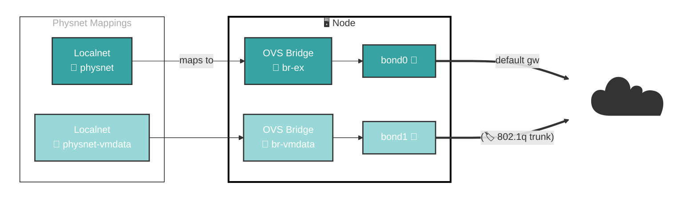
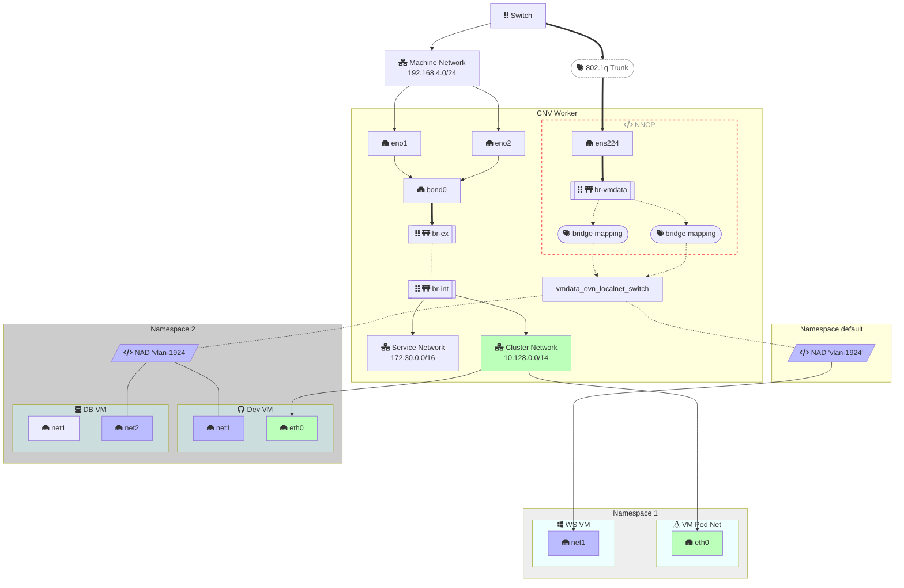
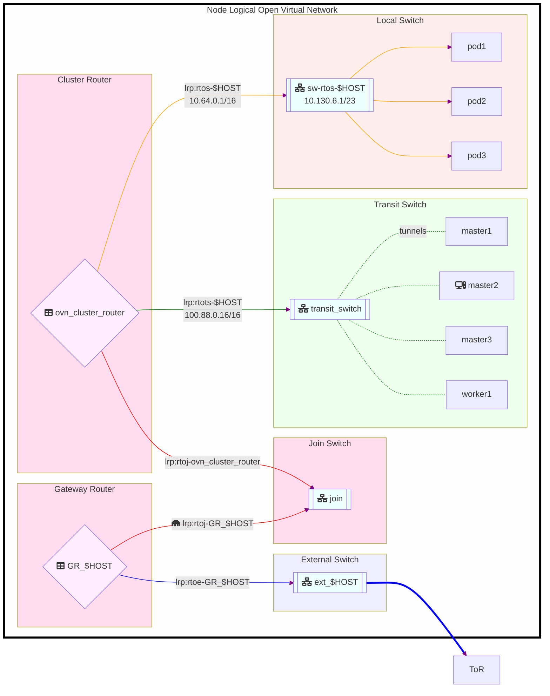
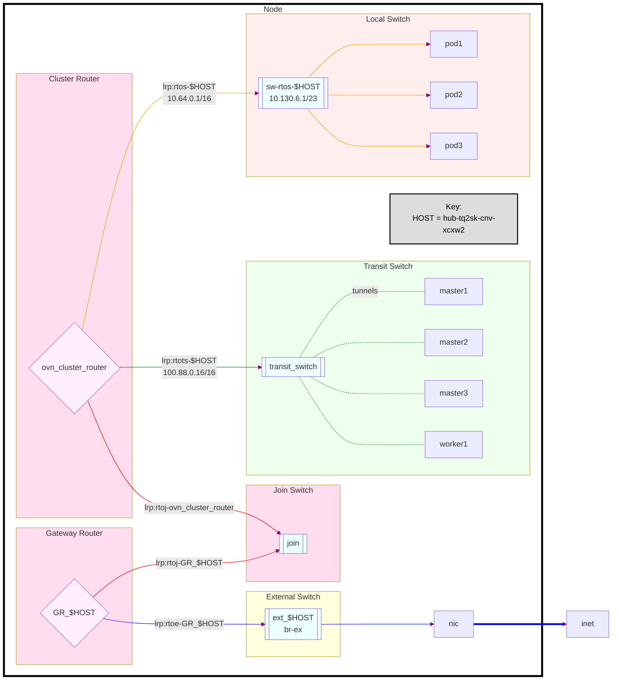

Virtual machine workloads are migrating to KubeVirt and OpenShift Virtualization at a rapid pace. Understanding how to securely access datacenter networks directly from pods will be critical to a successful migration. Read on to learn how [OVN-Kubernetes][11], [NMstate][3], and [Multus][12] work together to enable traditional architecutres in a cloud-native way.

<!--more-->

# Open Virtual Network

Open Virtual Network enables a high level representation of a software defined network. While virtual switches have been used in OpenShift for quite some time they were managed individualy, the method used to program and coordinate virtual switching and routing is now orchestrated by OVN technology.

<!--
Demo Script:

 -->

# Kubernetes Resource Management is API-First

All resources are managed by [APIs in Kubernetes][2]. This may be a new concept to some, but it is a great advantage over traditional infrastructure.
These APIs can be driven by the web console, by the command line, or application of resources using GitOps. The interfaces to these APIs are mediated by Custom Resource Definitions.

There are a number of standard resources on every cluster like `pods`, `services`, `deployments`, and additional custom resource definitions may be made available by installing operators like [NMstate][3] or [KubeVirt][4].

This means anytime you seek to understand how to accomplish a task in Kubernetes you should start by learning what resources exist.

# Networking APIs in OpenShift

This list will vary depending on the version of OpenShift (below is 4.21) and what operators are installed.

**Listing Networking API Groups**
```bash
$ NETWORKING_API_GROUPS=$(
    oc api-versions | \
    grep -E '(ovn|cni|metallb|nmstate|network|ipam)' | \
    sed 's#/v.*##' | sort -u)

$ echo $NETWORKING_API_GROUPS
frrk8s.metallb.io
gateway.networking.k8s.io
ipam.cluster.x-k8s.io
ipam.metal3.io
k8s.cni.cncf.io
k8s.ovn.org
metallb.io
network.operator.openshift.io
networkaddonsoperator.network.kubevirt.io
networking.k8s.io
nmstate.io
policy.networking.k8s.io
whereabouts.cni.cncf.io
```

> 

Now let's see what Custom Resource Definitions are provided by each of these networking related API Groups

**Listing Networking APIs**
```bash
while read -r apig; do
 echo "# $apig"
 oc api-resources --api-group="$apig"
done <<< "$NETWORKING_API_GROUPS"
```

- **`frrk8s.metallb.io` [Free Range Routing Kubernetes][14]**
```bash
$ oc api-resources --api-group="frrk8s.metallb.io"
NAME                SHORTNAMES   APIVERSION                  NAMESPACED   KIND
bgpsessionstates                 frrk8s.metallb.io/v1beta1   true         BGPSessionState
frrconfigurations                frrk8s.metallb.io/v1beta1   true         FRRConfiguration
frrnodestates                    frrk8s.metallb.io/v1beta1   false        FRRNodeState
```

- **`gateway.networking.k8s.io` [Gateway API][15]**
```bash
$ oc api-resources --api-group="gateway.networking.k8s.io"
NAME              SHORTNAMES   APIVERSION                          NAMESPACED   KIND
gatewayclasses    gc           gateway.networking.k8s.io/v1        false        GatewayClass
gateways          gtw          gateway.networking.k8s.io/v1        true         Gateway
grpcroutes                     gateway.networking.k8s.io/v1        true         GRPCRoute
httproutes                     gateway.networking.k8s.io/v1        true         HTTPRoute
referencegrants   refgrant     gateway.networking.k8s.io/v1beta1   true         ReferenceGrant
```

- **`ingress.operator.openshift.io` [OpenShift Ingress Operator][16]**
```bash
$ oc api-resources --api-group="ingress.operator.openshift.io"
NAME         SHORTNAMES   APIVERSION                         NAMESPACED   KIND
dnsrecords                ingress.operator.openshift.io/v1   true         DNSRecord
```

- **`ipam.cluster.x-k8s.io` [Cluster API IPAM][17]**
```bash
$ oc api-resources --api-group="ipam.cluster.x-k8s.io"
NAME              SHORTNAMES   APIVERSION                      NAMESPACED   KIND
ipaddressclaims                ipam.cluster.x-k8s.io/v1beta1   true         IPAddressClaim
ipaddresses                    ipam.cluster.x-k8s.io/v1beta1   true         IPAddress
```

- **`ipam.metal3.io` [Metal3 IP Address Manager][18]**
```bash
$ oc api-resources --api-group="ipam.metal3.io"
NAME          SHORTNAMES                                                                                  APIVERSION                NAMESPACED   KIND
ipaddresses   ipa,ipaddress,m3ipa,m3ipaddress,m3ipaddresses,metal3ipa,metal3ipaddress,metal3ipaddresses   ipam.metal3.io/v1alpha1   true         IPAddress
ipclaims      ipc,ipclaim,m3ipc,m3ipclaim,m3ipclaims,metal3ipc,metal3ipclaim,metal3ipclaims               ipam.metal3.io/v1alpha1   true         IPClaim
ippools       ipp,ippool,m3ipp,m3ippool,m3ippools,metal3ipp,metal3ippool,metal3ippools                    ipam.metal3.io/v1alpha1   true         IPPool
```

- **`k8s.cni.cncf.io` [Multus CNI][19]**
```bash
$ oc api-resources --api-group="k8s.cni.cncf.io"
NAME                             SHORTNAMES       APIVERSION                 NAMESPACED   KIND
ipamclaims                                        k8s.cni.cncf.io/v1alpha1   true         IPAMClaim
multi-networkpolicies            multi-policy     k8s.cni.cncf.io/v1beta1    true         MultiNetworkPolicy
network-attachment-definitions   net-attach-def   k8s.cni.cncf.io/v1         true         NetworkAttachmentDefinition
```

- **`k8s.ovn.org` [OVN-Kubernetes][11]**
```bash
$ oc api-resources --api-group="k8s.ovn.org"
NAME                             SHORTNAMES         APIVERSION       NAMESPACED   KIND
adminpolicybasedexternalroutes   apbexternalroute   k8s.ovn.org/v1   false        AdminPolicyBasedExternalRoute
clusteruserdefinednetworks                          k8s.ovn.org/v1   false        ClusterUserDefinedNetwork
egressfirewalls                                     k8s.ovn.org/v1   true         EgressFirewall
egressips                        eip                k8s.ovn.org/v1   false        EgressIP
egressqoses                                         k8s.ovn.org/v1   true         EgressQoS
egressservices                                      k8s.ovn.org/v1   true         EgressService
routeadvertisements              ra                 k8s.ovn.org/v1   false        RouteAdvertisements
userdefinednetworks                                 k8s.ovn.org/v1   true         UserDefinedNetwork
```

- **`metallb.io` [MetalLB][20]**
```bash
$ oc api-resources --api-group="metallb.io"
NAME                  SHORTNAMES   APIVERSION           NAMESPACED   KIND
bfdprofiles                        metallb.io/v1beta1   true         BFDProfile
bgpadvertisements                  metallb.io/v1beta1   true         BGPAdvertisement
bgppeers                           metallb.io/v1beta2   true         BGPPeer
communities                        metallb.io/v1beta1   true         Community
configurationstates                metallb.io/v1beta1   true         ConfigurationState
ipaddresspools                     metallb.io/v1beta1   true         IPAddressPool
l2advertisements                   metallb.io/v1beta1   true         L2Advertisement
metallbs                           metallb.io/v1beta1   true         MetalLB
servicebgpstatuses                 metallb.io/v1beta1   true         ServiceBGPStatus
servicel2statuses                  metallb.io/v1beta1   true         ServiceL2Status
```

- **`network.operator.openshift.io` [OpenShift Cluster Network Operator][21]**
```bash
$ oc api-resources --api-group="network.operator.openshift.io"
NAME            SHORTNAMES   APIVERSION                         NAMESPACED   KIND
egressrouters                network.operator.openshift.io/v1   true         EgressRouter
operatorpkis                 network.operator.openshift.io/v1   true         OperatorPKI
```

- **`networkaddonsoperator.network.kubevirt.io` [KubeVirt Cluster Network Addons Operator][22]**
```bash
$ oc api-resources --api-group="networkaddonsoperator.network.kubevirt.io"
NAME                   SHORTNAMES   APIVERSION                                     NAMESPACED   KIND
networkaddonsconfigs                networkaddonsoperator.network.kubevirt.io/v1   false        NetworkAddonsConfig
```

- **`networking.k8s.io` [Kubernetes Networking API][23]**
```bash
$ oc api-resources --api-group="networking.k8s.io"
NAME              SHORTNAMES   APIVERSION             NAMESPACED   KIND
ingressclasses                 networking.k8s.io/v1   false        IngressClass
ingresses         ing          networking.k8s.io/v1   true         Ingress
ipaddresses       ip           networking.k8s.io/v1   false        IPAddress
networkpolicies   netpol       networking.k8s.io/v1   true         NetworkPolicy
servicecidrs                   networking.k8s.io/v1   false        ServiceCIDR
```

- **`nmstate.io` [Kubernetes NMState][24]**
```bash
$ oc api-resources --api-group="nmstate.io"
NAME                                 SHORTNAMES   APIVERSION           NAMESPACED   KIND
nmstates                                          nmstate.io/v1        false        NMState
nodenetworkconfigurationenactments   nnce         nmstate.io/v1beta1   false        NodeNetworkConfigurationEnactment
nodenetworkconfigurationpolicies     nncp         nmstate.io/v1        false        NodeNetworkConfigurationPolicy
nodenetworkstates                    nns          nmstate.io/v1beta1   false        NodeNetworkState
```

- **`policy.networking.k8s.io` [Network Policy API][25]**
```bash
$ oc api-resources --api-group="policy.networking.k8s.io"
NAME                           SHORTNAMES   APIVERSION                          NAMESPACED   KIND
adminnetworkpolicies           anp          policy.networking.k8s.io/v1alpha1   false        AdminNetworkPolicy
baselineadminnetworkpolicies   banp         policy.networking.k8s.io/v1alpha1   false        BaselineAdminNetworkPolicy
```

- **`route.openshift.io` [OpenShift Route API][26]**
```bash
$ oc api-resources --api-group="route.openshift.io"
NAME     SHORTNAMES   APIVERSION              NAMESPACED   KIND
routes                route.openshift.io/v1   true         Route
```

- **`whereabouts.cni.cncf.io` [Whereabouts CNI IPAM][27]**
```bash
$ oc api-resources --api-group="whereabouts.cni.cncf.io"
NAME                             SHORTNAMES   APIVERSION                         NAMESPACED   KIND
ippools                                       whereabouts.cni.cncf.io/v1alpha1   true         IPPool
nodeslicepools                                whereabouts.cni.cncf.io/v1alpha1   true         NodeSlicePool
overlappingrangeipreservations                whereabouts.cni.cncf.io/v1alpha1   true         OverlappingRangeIPReservation
```

<!-- Duplicated for collapsable only: markdownify cannot see link defs outside .Inner (same URLs as # References). -->
[11]: <https://ovn-kubernetes.io/> "OVN-Kubernetes"
[14]: <https://github.com/metallb/frr-k8s> "Free Range Routing Kubernetes (frr-k8s)"
[15]: <https://gateway-api.sigs.k8s.io/> "Gateway API"
[16]: <https://github.com/openshift/cluster-ingress-operator> "OpenShift Cluster Ingress Operator"
[17]: <https://cluster-api.sigs.k8s.io/developer/providers/contracts/ipam> "Cluster API IPAM Contract"
[18]: <https://github.com/metal3-io/ip-address-manager> "Metal3 IP Address Manager"
[19]: <https://k8snetworkplumbingwg.github.io/multus-cni/> "Multus CNI"
[20]: <https://metallb.io/> "MetalLB"
[21]: <https://github.com/openshift/cluster-network-operator> "OpenShift Cluster Network Operator"
[22]: <https://github.com/kubevirt/cluster-network-addons-operator> "KubeVirt Cluster Network Addons Operator"
[23]: <https://kubernetes.io/docs/concepts/services-networking/> "Kubernetes Services and Networking"
[24]: <https://nmstate.io/kubernetes-nmstate/> "Kubernetes NMState"
[25]: <https://network-policy-api.sigs.k8s.io/> "Network Policy API"
[26]: <https://docs.openshift.com/container-platform/latest/networking/routes/secured-routes.html> "OpenShift Route Documentation"
[27]: <https://github.com/k8snetworkplumbingwg/whereabouts> "Whereabouts CNI IPAM"



There are a lot of Networking APIs, so which ones do you need to focus on?

# Networking Resource Management in Kubernetes

It is important to begin configuration at the host level. If you don't have the wires plugged into the correct ports and a configuration that matches the switch, you will not have a solid ground to build upon. The APIs that are most relevant for this first level starts with [NMstate][24].

## Network Configuration with Network Configuration Operator

[ ] Todo - how to cover this operator

## Host Network Configuration with NMState

Typically your default interface configuration including your external bridge (management interface) are configured by the installation process. This process may leverage the same NMStateConfig syntax as the NNCP we will discuss below, but there are supplied to the installer before NMState is even present.

After installation, unless you have a fully automated install including configuration, you may need to configure additional bonds or bridges on the nodes. For example `bond1` and `br-vmdata` in the following diagram.


```mermaid
graph LR;
    subgraph Cluster[" "]

      subgraph Localnets["Physnet Mappings"]
        physnet-ex[Localnet<br> 🧭 physnet]
        physnet-vmdata[Localnet<br> 🧭 physnet-vmdata]
      end

      subgraph node1["🖥️ Node "]
        br-ex[ OVS Bridge<br> 🔗 br-ex]
        br-vmdata[ OVS Bridge<br> 🔗 br-vmdata]
        node1-bond0[bond0 🔌]
        node1-bond1[bond1 🔌]
      end
    end

    physnet-ex -- maps to --> br-ex
    physnet-vmdata --> br-vmdata
    br-ex --> node1-bond0
    br-vmdata --> node1-bond1

    Internet["☁️ "]:::Internet
    node1-bond0 ==default gw==> Internet
    node1-bond1 ==(🏷️ 802.1q trunk)==> Internet

    classDef bond0 fill:#37A3A3,color:#fff,stroke:#333,stroke-width:2px
    class br-ex,physnet-ex,node1-bond0 bond0

    classDef bond1 fill:#9ad8d8,color:#fff,stroke:#333,stroke-width:2px
    class br-vmdata,physnet-vmdata,node1-bond1 bond1

    classDef labels stroke-width:1px,color:#fff,fill:#005577
    classDef networks fill:#cdd,stroke-width:0px

    style Localnets fill:#fff,color:#aaa,stroke:#000,stroke-width:1px
    style Cluster color:#000,fill:#fff,stroke:#333,stroke-width:0px
    style Internet fill:none,stroke-width:0px,font-size:+2em

    classDef nodes fill:#fff,stroke:#000,stroke-width:3px
    class node1,node2,node3 nodes

    classDef nad-1924 fill:#00ffff,color:#00f,stroke:#333,stroke-width:1px
    class nad-1924-client,nad-1924-ldap,nad-1924-nfs nad-1924
```


The NMState API group from the operator of the same name, is used to configure node level networking.

- `nmstate.io` [Kubernetes NMState][24]
```bash
$ oc api-resources --api-group="nmstate.io"
NAME                                 SHORTNAMES   APIVERSION           NAMESPACED   KIND
nmstates                                          nmstate.io/v1        false        NMState
nodenetworkconfigurationenactments   nnce         nmstate.io/v1beta1   false        NodeNetworkConfigurationEnactment
nodenetworkconfigurationpolicies     nncp         nmstate.io/v1        false        NodeNetworkConfigurationPolicy
nodenetworkstates                    nns          nmstate.io/v1beta1   false        NodeNetworkState
```

Once you identify the relevant resources for a task, you may want to read a description of the resource or find out read and write an instance of the resource in a YAML manifest.

> 
```yaml
$ oc explain nncp.spec
GROUP:      nmstate.io
KIND:       NodeNetworkConfigurationPolicy
VERSION:    v1

FIELD: spec <Object>


DESCRIPTION:
    NodeNetworkConfigurationPolicySpec defines the desired state of
    NodeNetworkConfigurationPolicy

FIELDS:
  capture       <map[string]string>
    Capture contains expressions with an associated name than can be referenced
    at the DesiredState.

  desiredState  <Object>
    The desired configuration of the policy

  maxUnavailable        <Object>
    MaxUnavailable specifies percentage or number
    of machines that can be updating at a time. Default is "50%".

  nodeSelector  <map[string]string>
    NodeSelector is a selector which must be true for the policy to be applied
    to the node.
    Selector which must match a node's labels for the policy to be scheduled on
    that node.
    More info:
    https://kubernetes.io/docs/concepts/configuration/assign-pod-node/
```


Notice above that a `NodeNetworkConfigurationPolicy` resource is not namespaced. A `NNCP` resource is cluster scoped, which means you can only have one NNCP with name "xyz". The NNCP can be targeted to a subset of nodes though. This is done using a NodeSelector value in the NNCP, and will be important if you have different networking connectivity in different servers. All the APIs in NMState are cluster scoped, in fact.

### Node Network State Resource

Once NMstate is installed and enabled, it will create and maintain a respresentation of each node's network state in a `NodeNetworkState` resource. You can see above that the shortname is `nns`.  We talked about this resource in [my last blog post][29] about [OVN Recon][30].

From the NNS, with a little `jq` magic we can learn all kinds of facts, including what NICs are installed and what driver they are using for example. This is also represented in the OpenShift console for browsing.

```bash
$ oc get nns/$NODE_NAME -o json |  \
  jq -c '.status.currentState.interfaces[]|select(.type=="ethernet") \
  |{"name":.name, "max-mtu":."max-mtu", "driver":.driver}';
```
```json
{"name":"ens192","max-mtu":9000,"driver":"vmxnet3"}
{"name":"ens224","max-mtu":9000,"driver":"vmxnet3"}
{"name":"genev_sys_6081","max-mtu":65465,"driver":null}
```

### Adding a Bond Interface

As an example, imagine we have 4 network interfaces called eno1, eno2, eno3, and eno4. At install time we may have selected to bind eno1 and eno2 into bond0. This bond will pass the default traffic including any overlay networks.

Now on day 2 we want to add a second bond which will be dedicated to virtual machine traffic. There are multiple [bonding modes supported by OpenShift Virtualization][31], but we will use LACP here.

We will create a NNCP to define the bond1 interface.

```yaml
apiVersion: nmstate.io/v1
kind: NodeNetworkConfigurationPolicy
metadata:
 name: bond1
spec:
  nodeSelector:
    node-role.kubernetes.io/worker: ""
  desiredState:
   interfaces:
     - name: bond1
       type: bond
       state: up
       ipv4:
         enabled: false
       link-aggregation:
         mode: 802.3ad
         options:
           miimon: "150"
         port:
           - eno3
           - eno4
```

### Adding an OVS Bridge

Once we have a physical connection to a secondary external network, we need to create a logical switch that will use this bond1 port as its "uplink" to the physical network segment plugged into it. This will be akin to a distributed vSwitch on another platform.

Again, we use an `NNCP` to create this.

- [nncp-bridge.yaml](https://github.com/dlbewley/demo-rhone-26/blob/main/components/br-vmdata/nncp.yaml)
```yaml
apiVersion: nmstate.io/v1
kind: NodeNetworkConfigurationPolicy
metadata:
  name: br-vmdata
spec:
  nodeSelector:
    node-role.kubernetes.io/worker: ""
  desiredState:
    interfaces:
      - name: br-vmdata
        type: ovs-bridge
        state: up
        bridge:
          allow-extra-patch-ports: true
          options:
            stp: false
          port:
            - name: bond1
```

### Naming the Physical Network

We have created a bond, we have added a bridge to that bond, and now we must give a name to this physical network. You may see this name referred to as a "bridge-mapping" or a "physicalNetworkName" or a "external network". You can simply think of this as an alias for the bridge, and it will be used to direct network connections to the bridge and out the port.

Here is the NNCP to create the external network name.


- [nncp-mapping.yaml](https://github.com/dlbewley/demo-rhone-26/blob/main/components/physnet-mapping/nncp.yaml)
```yaml
apiVersion: nmstate.io/v1
kind: NodeNetworkConfigurationPolicy
metadata:
  name: ovs-bridge-mapping-physnet-vmdata
spec:
  nodeSelector:
    node-role.kubernetes.io/worker: ""
  desiredState:
    ovn:
      bridge-mappings:
        - localnet: physnet-vmdata
          bridge: br-vmdata
          state: present
```

----- later

The NAD includes a blob of JSON data that defines a [CNI configuration][6]. The configuration drives a plugin that is one of several "types" with each type having additional arguments.

**CNI Plugin Types**

There are many, but these two are our focus here.

* `cnv-bridge` - Use when attaching to a Linux Bridge
* `ovn-k8s-cni-overlay` - Has a [topology parameter][8] which may be:
  * `Localnet` - Define network local to the node (datacenter networks)
  * `Layer2` - Define an overlay network (eg a private replication or healthcheck network)
  * `Layer3` - Define a routeable overlay network

We are
https://github.com/ovn-org/ovn-kubernetes/blob/master/docs/multi-homing.md#configuring-secondary-networks

Use the `ovn-k8s-cni-overlay` plugin type and the `localnet` topology.


Unfortunately, when it comes to localnet, the NAD is overloaded. Not only does it define a namespaced attachment it also references a logical network and will implicitely create it if not already defined. It may be reasonable to expect there to be a custom resource definition for a network, but it turns out to be a side effect of NAD at this time. **This can be a source of misconfiguration and confusion.**

# Accessing Datacenter VLANs from OpenShift Virtual Machines

To attach a virtual machine to a "physical" network in a datacenter, as opposed to the private cluster network already present on the OpenShift cluster, requires the coordination of a few resources.


# Visualizing The Network Configuration Resources


```mermaid
graph TD;

  switch["fa:fa-grip-vertical Switch"]
  machinenet["fa:fa-network-wired Machine Network<br> 192.168.4.0/24"]
  switch --> machinenet --> eno1
             machinenet --> eno2
  switch ==> T(["fa:fa-tags 802.1q Trunk"]) ==> ens224[ens224]

  subgraph node["CNV Worker"]
    eno1["fa:fa-ethernet eno1"]
    eno2["fa:fa-ethernet eno2"]
    eno1 --> bond0
    eno2 --> bond0
    bond0["fa:fa-ethernet bond0"]
    bond0 ==> br-ex[["fa:fa-grip-vertical fa:fa-bridge br-ex"]]
    br-int[["fa:fa-grip-vertical fa:fa-bridge br-int"]]
    br-ex -.- br-int
    servicenet["fa:fa-network-wired Service Network<br> 172.30.0.0/16"]
    clusternet["fa:fa-network-wired Cluster Network<br> 10.128.0.0/14"]

    br-int --> servicenet
    br-int --> clusternet

    subgraph nncp["fa:fa-code NNCP"]
      ens224["fa:fa-ethernet ens224"]
      ens224 ==> br-vmdata[["fa:fa-grip-vertical fa:fa-bridge br-vmdata"]]
      br-vmdata -.-> BM1924(["fa:fa-tags bridge mapping"])
      br-vmdata -.-> BM1926(["fa:fa-tags bridge mapping"])

    end

    BM1924 -.-> vmdata_ovn_localnet_switch
    BM1926 -.-> vmdata_ovn_localnet_switch

  end

  subgraph nsd["Namespace default"]
    nsd-nad-1924[/"fa:fa-code NAD 'vlan-1924'"/]
  end

  subgraph ns1["Namespace 1"]
    subgraph ns1-vm1[fab:fa-linux VM Pod Net]
        nginx-nic["fa:fa-ethernet eth0"]
    end
    clusternet ----> nginx-nic

    subgraph ns1-vm2[fab:fa-windows WS VM]
        ns1-vm2-nic1["fa:fa-ethernet net1"]
    end
    vmdata_ovn_localnet_switch  -.- nsd-nad-1924 --> ns1-vm2-nic1
  end

  subgraph ns2["Namespace 2"]
    subgraph ns2-vm1[fab:fa-github Dev VM]
        ns2-vm1-nic1["fa:fa-ethernet net1"]
        ns2-vm1-nic2["fa:fa-ethernet eth0"]
    end

    clusternet --> ns2-vm1-nic2

    subgraph ns2-vm2["fa:fa-database DB VM"]
        ns2-vm2-nic1["fa:fa-ethernet net1"]
        ns2-vm2-nic2["fa:fa-ethernet net2"]
    end

    vmdata_ovn_localnet_switch -.- ns2-nad-1924[/"fa:fa-code NAD 'vlan-1924'"/] --- ns2-vm1-nic1
                ns2-nad-1924                                   --- ns2-vm2-nic2
  end

  classDef clusterNet fill:#bfb
  class clusternet,nginx-nic,ns2-vm1-nic2 clusterNet

  classDef vlan-1924 fill:#bbf
  class ens224.1924,br-1924,nsd-nad-1924,ns1-nad-1924,ns2-nad-1924,ns1-vm2-nic1,ns1-ws2-1924,ns2-vm1-nic1,ns2-vm2-nic2 vlan-1924

  style nncp stroke:#f66,stroke-width:2px,color:#999,stroke-dasharray: 5 5
  style T fill:white,stroke:darkgrey,stroke-width:1px,color:#333,stroke-dasharray: 2 2

  classDef ns1-vm fill:#eff
  class ns1-vm1,ns1-vm2 ns1-vm
  style ns1 fill:#eee

  classDef ns2-vm fill:#cdd
  class ns2-vm1,ns2-vm2,ns2-vm3 ns2-vm
  style ns2 fill:#ccc
```

<!-- # Random Notes WIP

sh-5.1# ovn-nbctl ls-list
53f7a7bd-6a46-46e7-ad53-4dc1b6f72ab9 (ext_hub-tq2sk-worker-0-8dhw2)
d0d0bd99-2ab7-428e-a8df-407bb54d6a89 (hub-tq2sk-worker-0-8dhw2)
e9a78dfc-97ef-49bd-8c6a-ada8d6ba19e6 (isolated_ovn_layer2_switch)
182d7ca6-68d4-4674-aac5-8c0403de272a (join)
8eb50e3d-d496-4d4b-a99a-17845b5be6d8 (transit_switch)
7be57691-0876-40b2-9f47-c7621d9a43a3 (vlan.1924_ovn_localnet_switch)
47f1848c-8874-4aaf-9a29-f8ef435cf02a (vlan.1926_ovn_localnet_switch)

 -->



```mermaid
graph LR;

subgraph Node[Node Logical Open Virtual Network]


  subgraph ext_hub-tq2sk-cnv-xcxw2["External Switch"]
    sw-ext[["fa:fa-network-wired ext_$HOST"]]
  end

  subgraph join["Join Switch"]
    sw-join[["fa:fa-network-wired join"]]
  end

  subgraph GR_$HOST["Gateway Router"]
    rt-gw{"fa:fa-table GR_$HOST"}
    rt-gw -- fa:fa-ethernet lrp:rtoj-GR_$HOST --> sw-join
    rt-gw -- lrp:rtoe-GR_$HOST --> sw-ext
  end

  subgraph transit["Transit Switch"]
    sw-transit[["fa:fa-network-wired transit_switch"]]
    sw-transit -. tunnels .- master1
    sw-transit -.- master2["fa:fa-computer master2"]
    sw-transit -.- master3
    sw-transit -.- worker1
  end

  subgraph sw-rtos-$HOST["Local Switch "]
    sw-local[["fa:fa-network-wired sw-rtos-$HOST\n10.130.6.1/23"]]
    sw-local --> pod1
    sw-local --> pod2
    sw-local --> pod3
  end

  subgraph ovn_cluster_router["Cluster Router"]
    rt-cluster{"fa:fa-table ovn_cluster_router"}
    rt-cluster -- lrp:rtos-$HOST\n 10.64.0.1/16 --> sw-local
    rt-cluster -- lrp:rtots-$HOST\n 100.88.0.16/16 --> sw-transit
    rt-cluster -- lrp:rtoj-ovn_cluster_router --> sw-join
  end

  end
  sw-ext ==> ToR


  classDef key fill:#ddd, color:black, stroke:black, stroke-width:2
  class hostname key

  classDef nodes fill:#fefefe, stroke:black, stroke-width:4
  class Node nodes

  classDef switch fill:#eff
  class sw-join,sw-transit,sw-local,sw-ext switch

  classDef router fill:#fef
  class rt-gw,rt-cluster router

  classDef routers fill:#fde
  class ovn_cluster_router,GR_$HOST routers

  style ext_hub-tq2sk-cnv-xcxw2 fill:#eef
  style transit fill:#efe
  style join fill:#fde
  style sw-rtos-$HOST fill:#fee

  classDef key fill:#ddd, color:black, stroke:black, stroke-width:2
  class hostname key

  classDef switch fill:#eff
  class sw-join,sw-transit,sw-local,sw-ext switch

  linkStyle default stroke:purple
  linkStyle 1,12 stroke:blue
  linkStyle 0,11 stroke:red
  linkStyle 2,3,4,5,10 stroke:green
  linkStyle 6,7,8,9 stroke:orange
```



```mermaid
graph LR;

subgraph Node
  hostname["Key:\nHOST = hub-tq2sk-cnv-xcxw2"]

  nic

  subgraph ext_hub-tq2sk-cnv-xcxw2["External Switch"]
    sw-ext[[ext_$HOST\n br-ex]]
  end

  sw-ext --> nic

  subgraph join["Join Switch"]
    sw-join[[join]]
  end

  subgraph GR_$HOST["Gateway Router"]
    rt-gw{"GR_$HOST"}
    rt-gw -- lrp:rtoj-GR_$HOST --> sw-join
    rt-gw -- lrp:rtoe-GR_$HOST --> sw-ext
  end

  subgraph transit["Transit Switch"]
    sw-transit[[transit_switch]]
    sw-transit -. tunnels .- master1
    sw-transit -.- master2
    sw-transit -.- master3
    sw-transit -.- worker1
  end

  subgraph sw-rtos-$HOST["Local Switch "]
    sw-local[["sw-rtos-$HOST\n10.130.6.1/23"]]
    sw-local --> pod1
    sw-local --> pod2
    sw-local --> pod3
  end

  subgraph ovn_cluster_router["Cluster Router"]
    rt-cluster{"ovn_cluster_router"}
    rt-cluster -- lrp:rtos-$HOST\n 10.64.0.1/16 --> sw-local
    rt-cluster -- lrp:rtots-$HOST\n 100.88.0.16/16 --> sw-transit
    rt-cluster -- lrp:rtoj-ovn_cluster_router --> sw-join
  end

  end
  nic ==> inet
inet
  classDef nodes fill:white, stroke:black, stroke-width:4
  class Node nodes

  classDef routers fill:#fde
  class ovn_cluster_router,GR_$HOST routers

  style transit fill:#efe
  style join fill:#fde
  style sw-rtos-$HOST fill:#fee

  classDef key fill:#ddd, color:black, stroke:black, stroke-width:2
  class hostname key

  classDef switch fill:#eff
  class sw-join,sw-transit,sw-local,sw-ext switch

  classDef router fill:#fef
  class rt-gw,rt-cluster router

  linkStyle default stroke:purple
  linkStyle 0,2,13 stroke:blue
  linkStyle 1,12 stroke:red
  linkStyle 3,4,5,6 stroke:green
  linkStyle 7,8,9,10 stroke:orange
  linkStyle 11 stroke:green

```

# Node Level View

ssh or debug into the node
In the node OS there is no ovn-nbctl only an ovs-vsctl

```bash
sh-5.1# hostname
hub-v4tbg-cnv-99zmp

sh-5.1# ovs-vsctl list-br
br-ex
br-int
br-vmdata

sh-5.1# nmcli con
NAME                UUID                                  TYPE           DEVICE
ovs-if-br-ex        aec716fd-096b-4ef6-a6cb-96d8fecf5fe3  ovs-interface  br-ex
Wired connection 2  10391244-3dbb-3ade-a26d-f8c361c346b2  ethernet       ens224
br-ex               da9a4c2c-9071-445c-8426-183b5b3e05f0  ovs-bridge     br-ex
br-vmdata-br        2acd0411-fa90-435e-9bec-1b3d9a5ef827  ovs-bridge     br-vmdata
ens224-port         1cf8c810-a55b-4938-8f00-f2ca57803881  ovs-port       ens224
ovs-if-phys0        902e86b9-6c95-4845-b9eb-64fbb3cca58b  ethernet       ens192
ovs-port-br-ex      561b1a06-3a6b-4313-b119-5d3f3caf1800  ovs-port       br-ex
ovs-port-phys0      404a5336-503f-4144-961e-35635fd92fc6  ovs-port       ens192
lo                  efb54016-6e10-4020-bb8b-fd2d8c6577a0  loopback       lo
Wired connection 1  bcd3a32d-6de8-3ebc-87b1-8f843871b1e3  ethernet       --
```

ovs-vsctl show will display all the Open vSwitch bridges and ports.

We can view the ports exist on a given bridge

```bash
sh-5.1# ovs-vsctl list-ports br-ex
ens192
patch-br-ex_hub-v4tbg-cnv-99zmp-to-br-int
sh-5.1# ovs-vsctl list-ports br-vmdata
ens224
patch-vlan.1924_ovn_localnet_port-to-br-int
```

We can view what networks are mapped to which OVS bridges.

```bash
sh-5.1# ovs-vsctl get Open_vSwitch . external_ids:ovn-bridge-mappings
"machine-net:br-ex,physnet:br-ex,trunk:br-trunk,vlan-1924:br-vmdata,vlan-1926:br-vmdata"
```

# WIP Topics

## Test Cases to Explore

### Dual NIC √
* NIC 1: Default Interface, `br-ex`
* NIC 2: 802.1q trunk  VM Data Interface, `br-vmdata`

### Single NIC without VLANs
* NIC :one: 1: Default Interface, `br-ex`

### Single NIC with 802.1q and a native VLAN for br-ex

### Single NIC with 802.1q and a tagged VLAN for br-ex

# Summary

It is important to understand that the name found in the multus config defines a logical network and that [network name is cluster-scoped][8], meaning it should not be re-used unless the configuration is identical.

# References

* [Secondary networks connected to the physical underlay for KubeVirt VMs using OVN-Kubernetes][1] - kubevirt.io
* [Kubernetes API Concepts][2]
* [NMstate][3], [OpenShift 4.21 NMState Operator Docs][28]
* [KubeVirt][4]
* [Connecting OpenShift VM to an OVN Secondary Network][5] - OpenShift Docs
* [CNI Specification][6]
* [Free Range Routing Kubernetes (frr-k8s)][14]
* [Gateway API][15]
* [OpenShift Cluster Ingress Operator][16]
* [Cluster API IPAM Contract][17]
* [Metal3 IP Address Manager][18]
* [Multus CNI][19]
* [MetalLB][20]
* [OpenShift Cluster Network Operator][21]
* [KubeVirt Cluster Network Addons Operator][22]
* [Kubernetes Services and Networking][23]
* [Kubernetes NMState][24]
* [Network Policy API][25]
* [OpenShift Route Documentation][26]
* [Whereabouts CNI IPAM][27]
* [Which bonding modes work when used with a bridge that virtual machine guests or containers connect to?][31]

[1]: <https://kubevirt.io/2023/OVN-kubernetes-secondary-networks-localnet.html> "Secondary networks connected to the physical underlay for KubeVirt VMs using OVN-Kubernetes"
[2]: <https://kubernetes.io/docs/reference/using-api/api-concepts/> "Kubernetes API Concepts"
[3]: <https://nmstate.io/> "NMstate"
[4]: <https://kubevirt.io> "KubeVirt"
[5]: <https://docs.openshift.com/container-platform/4.15/virt/vm_networking/virt-connecting-vm-to-ovn-secondary-network.html> "Connecting OpenShift VM to an OVN Secondary Network"
[6]: <https://github.com/containernetworking/cni/blob/spec-v0.4.0/SPEC.md> "CNI v0.4.0 Specification"
[7]: <https://github.com/ovn-org/ovn-kubernetes> "OVN-Kubernetes CNI Plugin"
[8]: <https://github.com/ovn-org/ovn-kubernetes/blob/master/docs/multi-homing.md> "Networks are not namespaced"
[9]: <https://issues.redhat.com/browse/CNV-16692> "OpenShift Virt Feature: OVN Secondary Network"
[10]: <https://github.com/ovn-org/ovn-kubernetes/blob/master/docs/features/multiple-networks/multi-homing.md> "OVN-Kubernetes Multihoming"
[11]: <https://ovn-kubernetes.io/> "OVN-Kubernetes"
[12]: <https://github.com/k8snetworkplumbingwg/multus-cni> "Multus CNI"
[13]: <https://kubernetes.io/docs/concepts/services-networking/#the-kubernetes-network-model> "The Kubernetes Network Model"
[14]: <https://github.com/metallb/frr-k8s> "Free Range Routing Kubernetes (frr-k8s)"
[15]: <https://gateway-api.sigs.k8s.io/> "Gateway API"
[16]: <https://github.com/openshift/cluster-ingress-operator> "OpenShift Cluster Ingress Operator"
[17]: <https://cluster-api.sigs.k8s.io/developer/providers/contracts/ipam> "Cluster API IPAM Contract"
[18]: <https://github.com/metal3-io/ip-address-manager> "Metal3 IP Address Manager"
[19]: <https://k8snetworkplumbingwg.github.io/multus-cni/> "Multus CNI"
[20]: <https://metallb.io/> "MetalLB"
[21]: <https://github.com/openshift/cluster-network-operator> "OpenShift Cluster Network Operator"
[22]: <https://github.com/kubevirt/cluster-network-addons-operator> "KubeVirt Cluster Network Addons Operator"
[23]: <https://kubernetes.io/docs/concepts/services-networking/> "Kubernetes Services and Networking"
[24]: <https://nmstate.io/kubernetes-nmstate/> "Kubernetes NMState"
[25]: <https://network-policy-api.sigs.k8s.io/> "Network Policy API"
[26]: <https://docs.openshift.com/container-platform/latest/networking/routes/secured-routes.html> "OpenShift Route Documentation"
[27]: <https://github.com/k8snetworkplumbingwg/whereabouts> "Whereabouts CNI IPAM"
[28]: <https://docs.redhat.com/en/documentation/openshift_container_platform/4.21/html/networking_operators/k8s-nmstate-about-the-k8s-nmstate-operator> "OpenShift 4.21 NMState Operator Docs"
[29]:  "Announcing OVN Recon"
[30]: <https://github.com/dlbewley/ovn-recon/> "OVN Recon"
[31]: <https://access.redhat.com/solutions/67546> "Which bonding modes work when used with a bridge that virtual machine guests or containers connect to?"