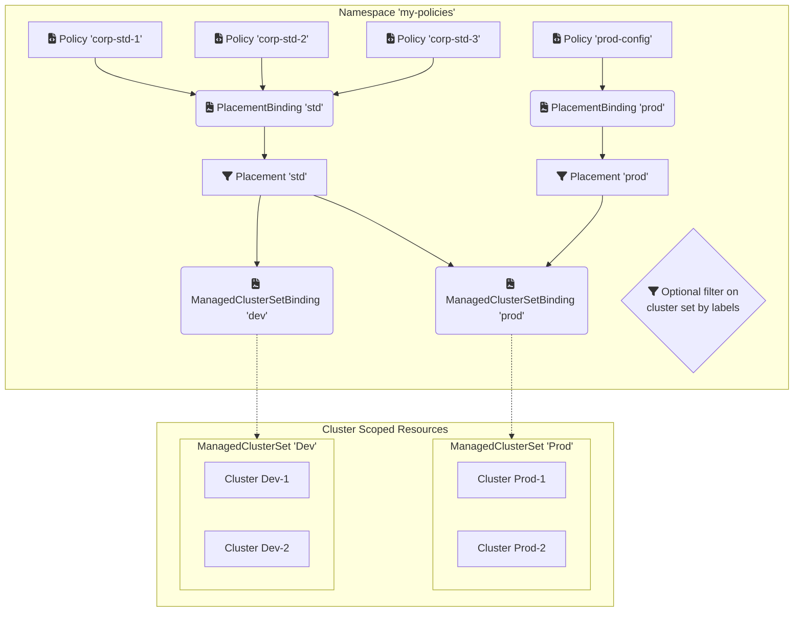

[Red Hat Advanced Cluster Management][4] (RHACM) enables Open Cluster Management policy driven governance of an entire fleet of Kubernetes clusters. Associating policies with the appropriate clusters is a very flexible operation and requires understanding resources like Placements and ManagedClusterSetBindings. So let's get familiar!

<!--more-->

# Open Cluster Management

Red Hat Advanced Cluster Management for Kubernetes implements the [Open Cluster Management][6] APIs for the deployment (placement) of governance policies.

## Policies

`Policy` resources are used to enact policies on a managed cluster. There is a large [collection of policies][5] that you can draw upon and customize for your particular use cases. This post focused only on the process of associating a policy with a cluster rather than what is in a given policy or how it is enacted.

> 
```bash {hl_lines=[7]}
$ oc api-resources --api-group policy.open-cluster-management.io
NAME                    SHORTNAMES   APIVERSION                                  NAMESPACED   KIND
certificatepolicies                  policy.open-cluster-management.io/v1        true         CertificatePolicy
configurationpolicies                policy.open-cluster-management.io/v1        true         ConfigurationPolicy
iampolicies                          policy.open-cluster-management.io/v1        true         IamPolicy
placementbindings       pb           policy.open-cluster-management.io/v1        true         PlacementBinding
policies                plc          policy.open-cluster-management.io/v1        true         Policy
policyautomations       plca         policy.open-cluster-management.io/v1beta1   true         PolicyAutomation
policysets              plcset       policy.open-cluster-management.io/v1beta1   true         PolicySet
```



Policies are scoped to a namespace as you can see in the API resources table above. Policies can be associated to specific clusters in a fleet through a `Placement` or a `PlacementRule` resource.

# Placement Rules

In the recent past resources called `PlacementRule` and `PlacementBindings` were used to associate a policy with a cluster. Those resources still exist but are `PlacementRule` is now deprecated in favor of the `Placement` resource. This change enables greater control, and brings with it some other resources to facilitate the grouping of clusters together into sets. These cluster sets enable more configurable RBAC.

> 
```bash {hl_lines=[8]}
$ oc api-resources --api-group apps.open-cluster-management.io
NAME                                SHORTNAMES                   APIVERSION                                 NAMESPACED   KIND
channels                                                         apps.open-cluster-management.io/v1         true         Channel
deployables                                                      apps.open-cluster-management.io/v1         true         Deployable
gitopsclusters                                                   apps.open-cluster-management.io/v1beta1    true         GitOpsCluster
helmreleases                                                     apps.open-cluster-management.io/v1         true         HelmRelease
multiclusterapplicationsetreports   appsetreport,appsetreports   apps.open-cluster-management.io/v1alpha1   true         MulticlusterApplicationSetReport
placementrules                                                   apps.open-cluster-management.io/v1         true         PlacementRule
subscriptionreports                 appsubreport                 apps.open-cluster-management.io/v1alpha1   true         SubscriptionReport
subscriptions                       appsub                       apps.open-cluster-management.io/v1         true         Subscription
subscriptionstatuses                appsubstatus                 apps.open-cluster-management.io/v1alpha1   true         SubscriptionStatus
```


# Managed Clusters and Managed Cluster Sets

RHACM can manage OpenShift and other Kubernetes clusters. See my previous [posts on RHACM]() for more background and recorded demonstrations.

Each  Kubernetes cluster managed by RHACM is represented by a `ManagedCluster` resource. This resource is cluster scoped. You can see this in the table below.

<!--
Demo Script:

oc api-resources --api-group cluster.open-cluster-management.io

oc get managedclustersets -A
oc get managedclustersetbindings -A
clear

oc get managedclustersetbindings global -n open-cluster-management-global-set -o yaml | yq
 -->

> 
```bash {hl_lines=[7]}
$ oc api-resources --api-group cluster.open-cluster-management.io
NAME                        SHORTNAMES                     APIVERSION                                    NAMESPACED   KIND
addonplacementscores                                       cluster.open-cluster-management.io/v1alpha1   true         AddOnPlacementScore
backupschedules             bsch                           cluster.open-cluster-management.io/v1beta1    true         BackupSchedule
clusterclaims                                              cluster.open-cluster-management.io/v1alpha1   false        ClusterClaim
clustercurators                                            cluster.open-cluster-management.io/v1beta1    true         ClusterCurator
managedclusters             mcl,mcls                       cluster.open-cluster-management.io/v1         false        ManagedCluster
managedclustersetbindings   mclsetbinding,mclsetbindings   cluster.open-cluster-management.io/v1beta2    true         ManagedClusterSetBinding
managedclustersets          mclset,mclsets                 cluster.open-cluster-management.io/v1beta2    false        ManagedClusterSet
placementdecisions                                         cluster.open-cluster-management.io/v1beta1    true         PlacementDecision
placements                                                 cluster.open-cluster-management.io/v1beta1    true         Placement
restores                    crst                           cluster.open-cluster-management.io/v1beta1    true         Restore
```


Multiple managed clusters may be grouped together into `ManagedClusterSets` for administrative and RBAC purposes. RHACM has two pre-defined cluster sets named _Global_ and _Default_. All clusters will be in the Global set, and they can be added to at most only one other set. You might create a cluster set for lifecycle like _Dev_ or cloud like _AWS_ for example.

## Managed Cluster Set Bindings

A `ManagedClusterSetBinding` is a namespaced resource designed to create a relationship between a namespace and a `ManagedClusterSet`. This resource is prerequisite to a `Placement`. Without this, a placement has no clusters visible to match against.

The Global managed cluserset set is already bound to the `open-cluster-management-global-set` by default. You can see this in the console when listing the cluster sets.

 <!-- if you want "Placement" to act the same way as "PlacementRule", you can create the policy, placement, and placement binding in the "open-cluster-management-global-set" since all clusters are bound to that namespace. -->



> 
  <p>Viewing ManagedClusterSet resources</p>
  
  


# Placement

A `Placement` exists to make a scheduling decision with regard to `Policies` and a selection of `ManagedClusters`. The result of a placement decision is a list of `ManagedClusters`. 

The placement decision begins with a list of managed clusters visibile through the lense of a `ManagedClusterSetBinding` in the same namespace.  Once the placement has this list it may optionally further winnow down that list through predicates like label selectors.

> :notebook: **Important**
> * `Placement` label selectors only match clusters that are visible via a `ManagedClusterSetBinding`
> * No clusters will be selected if no cluster set is bound to the namespace holding the placement resource

> ⭐ **Pro Tip** Use `oc explain placement` to find the information I reformatted below.

**Here is how the placement policy combines with other selection methods to determine a matching list of ManagedClusters:**

1. Kubernetes clusters are registered with hub as cluster-scoped `ManagedClusters`
2. `ManagedClusters` are organized into cluster-scoped `ManagedClusterSets`
3. `ManagedClusterSets` are bound to workload namespaces using `ManagedClusterSetBindings`
4. Namespace-scoped `Placements` specify a _slice_ of `ManagedClusterSets` which select a working set of _potential_ `ManagedClusters`
5. Then `Placements` _subselect_ from that working set using label/claim selection.

## Subselecting from Cluster Sets with Predicates

A placement can explicitly list the ClusterSets of interest or it can simply list the cluster label selectors. BUT the universe of possible clusters is constrained to those bound to the namespace via the [managed cluster set bindings]().

Here are examples of both use cases. Of course they may also be combined into one.

> :one: If a `Placement` specifies `spec.clusterSets[]` then it may specify a `spec.predicates.requiredClusterSelector{}` to filter the set of managed clusters.

```yaml
apiVersion: cluster.open-cluster-management.io/v1beta1
kind: Placement
metadata:
  name: placement-1
  namespace: ns1
spec:
  clusterSets:
    - clusterset1
    - clusterset2
```

> :two: If a `Placement` does not specify any `spec.clusterSets[]` it may still specify a `spec.predicates.requiredClusterSelector{}` which will only match against clusters found in sets bound to the current namespace (by a `ManagedClusterSetBinding`.)

```yaml
apiVersion: cluster.open-cluster-management.io/v1beta1
kind: Placement
metadata:
  name: placement-2
  namespace: ns1
spec:
  predicates:
  - requiredClusterSelector:
      labelSelector:
        matchExpressions:
          - {key: environment, operator: In, values: ["dev"]}
```

When more than one predicate is defined, they are OR'ed.  Refer to the [documentation][3] for more detail.

# Placement Binding

Once a placement produces a list of managed clusters the policy resource must be associated with and ultimately propagated to the clusters. This is the job of the `PlacementBinding`.

> :notebook:  A `PlacementBinding` binds a `Placement` to subjects (eg. `Policies`, `PolicySets`)

This example is pulled from a [documentation sample][1].

```yaml
apiVersion: policy.open-cluster-management.io/v1
kind: PlacementBinding
metadata:
  name: binding-policy-role
placementRef:
  name: placement-policy-role
  kind: Placement
  apiGroup: cluster.open-cluster-management.io
subjects:
- name: policy-role
  kind: Policy
  apiGroup: policy.open-cluster-management.io
```

# Fitting it all together

In this visual representation there are 3 corporate standard policies which we expect to apply to all 4 of our clusters, and there is 1 additional policy which we expect to apply to the production clusters.

This is accomplished by creating a standard ("STD") Placement that targets all clusters and a PROD Placement that matches only the production cluster. This targetting is permitted by the existance of the ManagedClusterSetBinding in this same namespace.




# Summary

`ManagedClusterSetBindings` provide a controlled lense through which ManagedClusterSets may be managed. By controlling the creation of ManagedClusterSetBindings, the Policy management task may be delegated to a namespace administrator while retaining the control over which clusters may be impacted by that namespace administrator.

# References

* [Red Hat Advanced Cluster Management for Kubernetes][4]
* [Placement Introduction][2]
* [Collection of policy examples for Open Cluster Management][5]
* [Open Cluster Management][6]


[1]: https://access.redhat.com/documentation/en-us/red_hat_advanced_cluster_management_for_kubernetes/2.9/html/governance/governance#policy-sample-file "Policy Sample File"
[2]: <https://access.redhat.com/documentation/en-us/red_hat_advanced_cluster_management_for_kubernetes/2.9/html/clusters/cluster_mce_overview#placement-intro> "Placement Introduction"
[3]: <https://access.redhat.com/documentation/en-us/red_hat_advanced_cluster_management_for_kubernetes/2.9/html/clusters/cluster_mce_overview#placement-labelselector-claimSelector> "Filtering ManagedClusters from ManagedClusterSets"
[4]: https://access.redhat.com/products/red-hat-advanced-cluster-management-for-kubernetes/ "RHACM"
[5]: <https://github.com/stolostron/policy-collection> "stolostron / policy-collection"
[6]: <https://open-cluster-management.io/> "Open Cluster Management"
